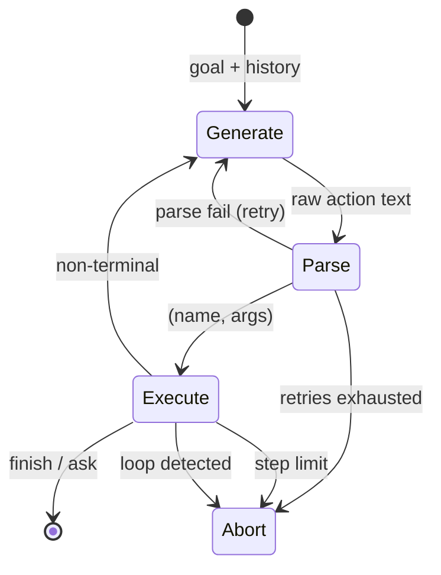
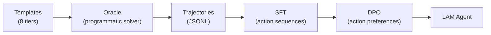

# Typo — LLM + LAM from Scratch

A **decoder-only transformer language model** and a **Language Action Model (LAM)** built entirely from scratch — custom tokenizer, architecture, pretraining, SFT, DPO, LoRA, RAG, tool-calling, **and a full agentic task-management system powered by LangGraph** — with a CLI and FastAPI server on top.

Every component (tokenizer, model, training loops, inference engine, action environment, agent graph) is **custom code**, not a wrapper around HuggingFace `transformers`.

> **~42M parameters** · RMSNorm · RoPE · SwiGLU · KV-cached inference · 16k BPE vocab · trains on a single GPU or Apple Silicon

---

##  What's in here

| Layer | What it does | Key files |
|---|---|---|
| **Core LLM** | Decoder-only transformer with RoPE, SwiGLU, RMSNorm, SDPA, KV cache | `kanha/core/` |
| **Tokenizer** | SentencePiece BPE trained from scratch (16k vocab) | `kanha/core/tokenizer.py` |
| **Pretraining** | Standard LM objective on WikiText / TinyStories | `kanha/training/train.py` |
| **SFT** | Instruction fine-tuning on Alpaca / OpenHermes | `kanha/finetune/sft_train.py` |
| **DPO** | Direct Preference Optimization alignment | `kanha/finetune/dpo_train.py` |
| **LoRA** | Parameter-efficient fine-tuning | `kanha/core/lora.py` |
| **RAG** | FAISS-backed retrieval augmented generation | `kanha/rag/` |
| **Tools** | Calculator, web search, router | `kanha/tools/` |
| **LAM** | Language Action Model — natural-language task manager | `kanha/lam/` |
| **LangGraph Agent** | LangGraph state-machine agent loop | `kanha/lam/langchain/` |
| **CLI + API** | Interactive REPL and FastAPI REST server | `cli.py`, `api.py` |

---

## The LAM — Tyro Tasks

The **Language Action Model** is the headline feature: a natural-language task manager where the small 42M-param model operates a real task store through structured actions.

You say things like *"move the dentist task to Friday"* or *"how many high-priority things are due today?"* and the model figures out the right sequence of actions.

### Why it works with a tiny model

| Constraint | Design decision |
|---|---|
| 512-token context | Max ~6 steps per task, tiny observations, action set learned in weights |
| ~42M params | Closed action space of 12 actions — needs language→action mapping, not world knowledge |
| Bad at dates/math | Model emits symbolic values (`due=tomorrow`, `prio=high`); the environment resolves them |
| Can't handle long lists | Observations show ≤6 rows + `(+N more)`; filters and bulk actions narrow queries |

### 12 Actions

```
add(title, due?, prio?, tag?)     list(due?, prio?, tag?, status?)
find(q)                           count(due?, prio?, tag?, status?)
edit(id, field, value)            done(id)
done_all(due?, prio?, tag?)       delete(id)
delete_done()                     undo()
ask(msg)                          finish(msg)
```

### 8 Difficulty Tiers

| Tier | What it tests | Example |
|---|---|---|
| 1 | Direct add | "add buy milk for tomorrow" |
| 2 | Query (list/count) | "how many high priority tasks today?" |
| 3 | Lookup → act | "move the dentist task to Friday" |
| 4 | Bulk / compound | "mark all work tasks done" |
| 5 | Narrowing (>6 tasks) | "show my tasks" → filters if overflow |
| 6 | Error recovery | "mark task 99 done" → handles not-found |
| 7 | Ambiguity | "finish the buy task" → asks which one |
| 8 | Out of scope | "book me a flight" → politely refuses |

### LangGraph Agent

The agent loop is implemented as a **LangGraph `StateGraph`**:

```
START → generate → parse → execute → decide
                     ↑         │         │
                     └─retry───┘    terminal? → END
                                    limit?   → ABORT
                                    loop?    → ABORT
                                    else     → generate
```

Two backends available:
- **Base agent** (`kanha.lam.agent.TaskAgent`) — zero-dependency while-loop
- **LangGraph agent** (`kanha.lam.langchain.graph.LangGraphTaskAgent`) — proper state machine with retry logic, loop detection, conditional edges

---

##  Quick Start

### 1. Install

```bash
git clone https://github.com/TanishqAtrey/lam-llm-from-scratch.git
cd lam-llm-from-scratch

python3 -m venv .venv
source .venv/bin/activate
pip install -r requirements.txt
```

### 2. Train the base model

```bash
# Train tokenizer
python main.py train-tokenizer

# Download and preprocess data
python scripts/download_datasets.py
python scripts/preprocess_data.py

# Pretrain
python main.py pretrain

# SFT
python main.py sft

# DPO (optional)
python main.py dpo
```

### 3. Train the LAM

```bash
# Generate synthetic training data (100k trajectories)
python main.py lam-generate --output data/lam/trajectories.jsonl --num 100000

# SFT on action sequences
python main.py lam-train --data data/lam/train.jsonl --output models/lam/

# DPO on action preferences (optional)
python main.py lam-dpo --data data/lam/dpo.jsonl --model models/lam/lam_sft.pt
```

### 4. Use the LAM agent

```bash
# Base agent (zero dependencies beyond PyTorch)
python main.py agent --model models/lam/lam_final.pt

# LangGraph agent
python main.py agent --model models/lam/lam_final.pt --langgraph
```

```
You: add buy milk for tomorrow, high priority
  Step 1: add(title="buy milk", due=tomorrow, prio=high)
    → Added: #1 buy milk | tomorrow | high
  Step 2: finish(msg="Task added.")
    → Task added.
✓ Task added.

You: how many tasks do I have?
  Step 1: count()
    → Count: 1
  Step 2: finish(msg="You have 1 task.")
    → You have 1 task.
✓ You have 1 task.
```

### 5. API server

```bash
uvicorn api:app --reload
```

```bash
# Regular chat
curl -X POST http://localhost:8000/chat \
  -H "Content-Type: application/json" \
  -d '{"prompt": "Hello!"}'

# LAM agent (with LangGraph)
curl -X POST http://localhost:8000/agent \
  -H "Content-Type: application/json" \
  -d '{"goal": "add buy milk for tomorrow", "use_langgraph": true}'
```

### 6. Evaluate

```bash
python main.py lam-eval --model models/lam/lam_final.pt --data data/lam/test.jsonl
```

---

## 🏗️ Architecture

### Transformer (42M params)

| Component | Choice | Why |
|---|---|---|
| Normalization | RMSNorm (pre-norm) | Faster than LayerNorm, stable training |
| Position encoding | RoPE | Relative positions, extrapolates well |
| Activation | SwiGLU | Better than GELU at this scale |
| Attention | SDPA + KV cache | Hardware-fused, O(1) per-token inference |
| Embeddings | Weight-tied (in ↔ out) | Saves 8M params |
| Dimensions | 8 layers, 8 heads, 512 dim, 2048 FFN | ~42M total |

### LAM Agent (LangGraph)



### Training Pipeline



---

##  Testing

```bash
# Run all LAM tests
python -m pytest tests/test_lam.py -v

# Run all tests
python -m pytest tests/ -v
```

The test suite (`tests/test_lam.py`) covers:
- **TaskStore**: CRUD, undo, persistence, filters, edge cases
- **Action parser**: all 12 actions, edge cases, validation
- **Environment**: step, reset, trajectory tracking
- **Trajectory**: formatting, step expansion
- **Data generation**: templates, oracle, generator, split
- **LangChain tools**: tool wrappers, execute_tool_by_name
- **LangGraph agent**: state typing, routing logic, result compatibility

---

##  Configuration

All hyperparameters live in `config.yaml`:

```yaml
model:
  d_model: 512
  n_heads: 8
  n_layers: 8
  d_ff: 2048
  max_seq_len: 512
  dropout: 0.1

training:
  batch_size: 32
  learning_rate: 3.0e-4
  weight_decay: 0.01
  warmup_steps: 500
  max_steps: 50000
  grad_clip: 1.0

lam:
  tier_weights: {tier1: 0.20, tier2: 0.15, ...}
  num_trajectories: 100000
  reference_date: "2025-01-15"
```

---

## License

This project is licensed under the **GNU General Public License v3.0** — see the [LICENSE](LICENSE) file for details.

